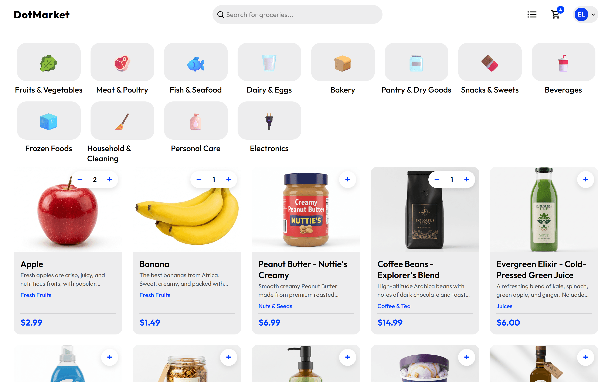
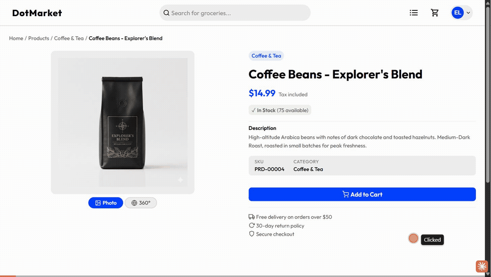
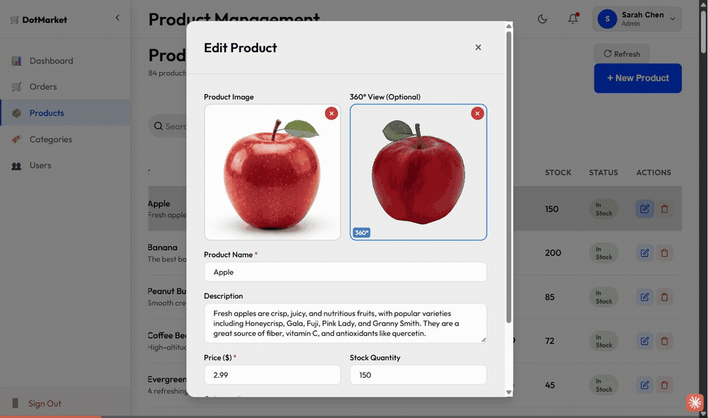
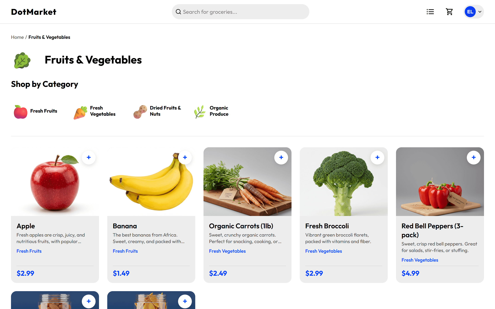
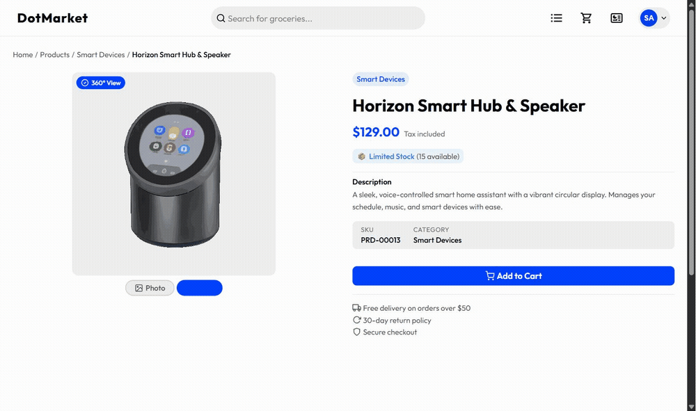
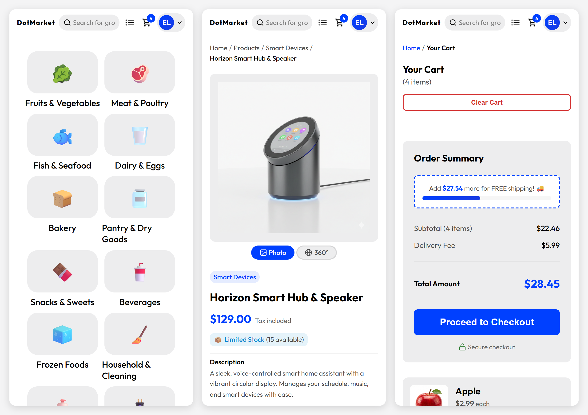
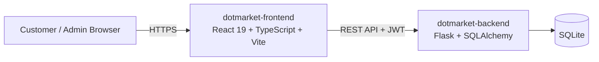

# 🛒 Dotmarket

**A full-stack supermarket e-commerce app** — customer shopping experience + a complete admin/manager back office, built to demonstrate production-style architecture across a decoupled frontend and backend.

---

## 📸 Preview

| Admin Dashboard | Cart → Checkout |
|---|---|
|  |  |

| Admin Product Editing | Category Browsing |
|---|---|
|  |  |

**🔄 Every one of the 84 products has a real 360° spin, not just a photo:**

---

## 🧭 What This Is

Dotmarket simulates a real supermarket's online storefront alongside the internal tooling that runs it — split into two independently deployable services, the way a small e-commerce product would actually be built and shipped:

- **Customers** browse categorized products, search, manage a cart, check out, and view order history.
- **Admins & managers** get a dashboard with live stats and low-stock alerts, full CRUD over products/categories, order status control, and user role management.

## ✨ Key Features

**Customer**
- Browse & search products across a full category tree
- 🔄 **360° product viewer** — every one of the 84 seeded products ships a real spin GIF, toggled from a Photo/360° switch on the product page
- Cart & checkout flow
- Order history & profile management

**Admin / Manager**
- Dashboard with stats and low-stock alerts
- Product & category CRUD
- Order status management
- User role management

## 🏗️ Architecture

Frontend and backend are **separate repositories and separately deployable services**, communicating over a REST API — not a single monolith:

| Repo | Role |
|---|---|
| [`dotmarket-frontend`](https://github.com/dotcomico/dotmarket-frontend) | Customer + admin UI |
| [`dotmarket-backend`](https://github.com/dotcomico/dotmarket-backend) | REST API, auth, business logic, database |

## 🛠️ Tech Stack

| Layer      | Technologies                              |
|------------|-------------------------------------------|
| Frontend   | React 19, TypeScript, Vite, React Router 7, Zustand, Axios |
| Backend    | Python 3.11, Flask, SQLAlchemy, JWT, Flask-CORS |
| Database   | SQLite (file-based)                       |
| Deployment | Docker (separate image per layer)         |

## 📚 Documentation

- [Quick Start](docs/QUICK_START.md) — run it locally or via Docker, test credentials, environment variables
- [API Reference](docs/API_REFERENCE.md) — REST endpoints
- [Docker Publishing Guide](docs/DOCKER_PUBLISHING.md) — build/tag/push the images (maintainers)

## 🔗 Links

- Frontend repo: https://github.com/dotcomico/dotmarket-frontend
- Backend repo: https://github.com/dotcomico/dotmarket-backend
- Live demo: _coming soon_

## 📄 License

[MIT](LICENSE)
